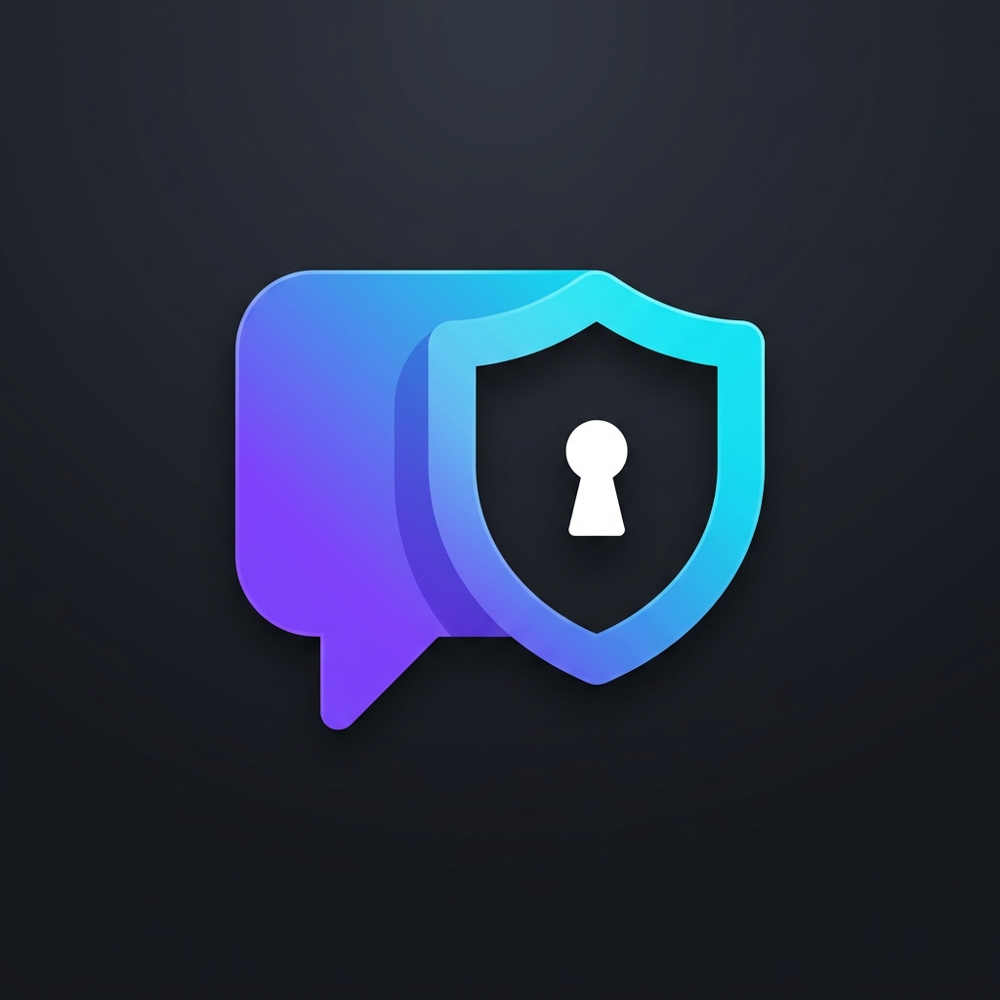

<p align="center">
  
</p>

<h1 align="center">🔒 OnlyUs — Private Chat</h1>

<p align="center">
  <strong>A private, disturbance-free chat website where people can talk freely — no email, no phone number, just a username and password.</strong>
</p>

<p align="center">
  
  
  
  
  
</p>

---

## ✨ Features

| Feature | Description |
|---------|-------------|
| 🔐 **Anonymous Auth** | Sign up with just a username + password. No email, no phone number. |
| 💬 **Real-time Chat** | Instant messaging powered by Socket.IO with typing indicators. |
| 👥 **Friend System** | Search users → Send friend request → Accept/Reject → Start chatting. |
| 👤 **User Profiles** | Upload profile photo, write a bio, view friends list. |
| 🟢 **Online Status** | See who's online with live green dots. |
| 🗑️ **Remove Friends** | Remove a friend and permanently delete all chat history on both sides. |
| 📱 **Responsive** | Works on desktop, tablet, and mobile browsers. |
| 🌙 **Dark Glassmorphism UI** | Premium dark theme with glass effects, gradients, and smooth animations. |

---

## 🖼️ Screenshots

> Sign up, chat with friends, edit your profile — all from the browser.

---

## 📁 Project Structure

```
onlyus/
│
├── 📄 index.html                    # HTML entry point
├── 📄 package.json                  # Dependencies & scripts
├── 📄 vite.config.js                # Vite config + API proxy
├── 📄 .gitignore                    # Git ignore rules
│
├── 🗂️ assets/                       # Static assets
│   └── 🖼️ logo.jpg                  # App logo
│
├── 🗂️ server/                       # ── Backend (Node.js + Express) ──
│   ├── 📄 index.js                  # Express server, REST API, Socket.IO
│   ├── 📄 db.js                     # SQLite database setup (sql.js WASM)
│   ├── 📦 onlyus.db                 # SQLite database file (auto-created)
│   └── 🗂️ middleware/
│       └── 📄 auth.js               # JWT authentication middleware
│
└── 🗂️ src/                          # ── Frontend (React + Vite) ──
    ├── 📄 main.jsx                  # React entry point
    ├── 📄 App.jsx                   # Root component (auth routing)
    ├── 🎨 index.css                 # Complete design system (dark theme)
    │
    ├── 🗂️ pages/
    │   ├── 📄 AuthPage.jsx          # Sign In / Sign Up page
    │   └── 📄 Dashboard.jsx         # Main app (sidebar + chat + search)
    │
    ├── 🗂️ components/
    │   ├── 📄 ChatWindow.jsx        # Chat messages + input area
    │   └── 📄 ProfileModal.jsx      # View/Edit profile modal
    │
    └── 🗂️ services/
        ├── 📄 api.js                # REST API client (auth, users, friends, messages)
        └── 📄 socket.js             # Socket.IO client (real-time events)
```

---

## 🛠️ Tech Stack

| Layer | Technology | Purpose |
|-------|-----------|---------|
| **Frontend** | React 19 + Vite | UI components & dev server |
| **Styling** | Vanilla CSS | Dark glassmorphism design system |
| **Backend** | Express.js | REST API + static file serving |
| **Real-time** | Socket.IO | Live messaging, typing indicators, online status |
| **Database** | sql.js (SQLite WASM) | Persistent storage — no DB server needed |
| **Auth** | JWT + bcrypt | Token-based auth with hashed passwords |
| **Icons** | Lucide React | Beautiful open-source icon set |

---

## 🚀 Getting Started

### Prerequisites

- [Node.js](https://nodejs.org/) (v18 or higher)
- npm (comes with Node.js)

### Installation

```bash
# 1. Clone the repository
git clone https://github.com/shiyan0x/Only-us.git
cd Only-us

# 2. Install dependencies
npm install

# 3. Start both servers (backend + frontend)
npm run dev
```

### Running Separately

```bash
# Terminal 1 — Backend server (port 3001)
node server/index.js

# Terminal 2 — Frontend dev server (port 5173)
npx vite --host
```

Then open **http://localhost:5173** in your browser.

### Access from Phone

Make sure your phone is on the **same WiFi** as your PC, then open:
```
http://<your-pc-ip>:5173
```

---

## 📊 Database Schema

```sql
-- Users (no email, no phone — just username + password)
CREATE TABLE users (
    id INTEGER PRIMARY KEY AUTOINCREMENT,
    username TEXT UNIQUE NOT NULL,
    displayName TEXT NOT NULL,
    passwordHash TEXT NOT NULL,
    avatarColor TEXT DEFAULT '#8b5cf6',
    avatarImage TEXT DEFAULT '',
    bio TEXT DEFAULT '',
    createdAt DATETIME DEFAULT CURRENT_TIMESTAMP,
    lastSeen DATETIME DEFAULT CURRENT_TIMESTAMP
);

-- Friend Requests (pending → accepted/rejected)
CREATE TABLE friend_requests (
    id INTEGER PRIMARY KEY AUTOINCREMENT,
    fromUserId INTEGER NOT NULL,
    toUserId INTEGER NOT NULL,
    status TEXT DEFAULT 'pending',   -- pending | accepted | rejected
    createdAt DATETIME DEFAULT CURRENT_TIMESTAMP,
    UNIQUE(fromUserId, toUserId)
);

-- Messages (private 1-to-1 chat)
CREATE TABLE messages (
    id INTEGER PRIMARY KEY AUTOINCREMENT,
    senderId INTEGER NOT NULL,
    receiverId INTEGER NOT NULL,
    content TEXT NOT NULL,
    read INTEGER DEFAULT 0,
    createdAt DATETIME DEFAULT CURRENT_TIMESTAMP
);
```

---

## 🔌 API Endpoints

### Auth
| Method | Endpoint | Description |
|--------|----------|-------------|
| `POST` | `/api/auth/signup` | Create new account |
| `POST` | `/api/auth/signin` | Sign in |
| `GET` | `/api/auth/me` | Get current user |

### Users & Profiles
| Method | Endpoint | Description |
|--------|----------|-------------|
| `GET` | `/api/users/search?q=` | Search users by username |
| `PUT` | `/api/users/profile` | Update own profile (name, bio, photo) |
| `GET` | `/api/users/profile/:userId` | Get any user's public profile |

### Friends
| Method | Endpoint | Description |
|--------|----------|-------------|
| `POST` | `/api/friends/request` | Send friend request |
| `GET` | `/api/friends/requests` | Get incoming & outgoing requests |
| `PUT` | `/api/friends/accept/:id` | Accept friend request |
| `PUT` | `/api/friends/reject/:id` | Reject friend request |
| `DELETE` | `/api/friends/:friendId` | Remove friend + delete all chats |
| `GET` | `/api/friends` | Get friends list |

### Messages
| Method | Endpoint | Description |
|--------|----------|-------------|
| `GET` | `/api/messages/:friendId` | Get chat history with a friend |

### Socket.IO Events
| Event | Direction | Description |
|-------|-----------|-------------|
| `message:send` | Client → Server | Send a message |
| `message:receive` | Server → Client | Receive a message |
| `message:read` | Both | Mark messages as read |
| `friend:request` | Server → Client | New friend request notification |
| `friend:accepted` | Server → Client | Friend request accepted |
| `friend:removed` | Server → Client | Friend was removed |
| `user:status` | Server → Client | Online/offline status change |
| `typing:start/stop` | Both | Typing indicator |

---

## 🌐 Deployment

Since OnlyUs has a **Node.js backend**, deploy to platforms that support Node.js:

| Platform | Free Tier | How |
|----------|-----------|-----|
| [Render](https://render.com) | ✅ Yes | Connect GitHub → Set build/start commands |
| [Railway](https://railway.app) | ✅ Trial | Connect GitHub → Auto-deploy |

**Build Command:** `npm install && npm run build`
**Start Command:** `node server/index.js`

---

## 🤝 Contributing

1. Fork the repository
2. Create a feature branch: `git checkout -b feature/new-feature`
3. Commit changes: `git commit -m "Add new feature"`
4. Push to branch: `git push origin feature/new-feature`
5. Open a Pull Request

---

## 📝 License

This project is open source and available under the [MIT License](LICENSE).

---

<p align="center">
  Made with 💜 by <a href="https://github.com/shiyan0x">shiyan0x</a>
</p>
